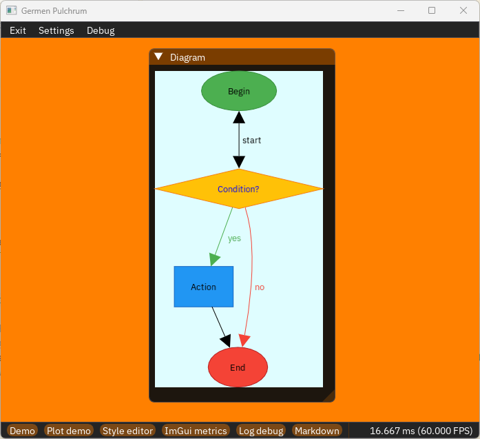
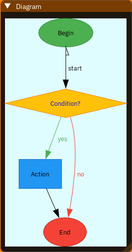

# ImGuiDot - Graphviz diagram in ImGui

ImGuiDot can render a simple Graphviz diagram in ImGui, like a widget, directly from the DOT language.\
It uses Graphviz 15.1.0 to parse the DOT language and compute the layout, then it renders the diagram using ImGui draw list.



## Minimum requirements

- language versions:
    - C++11 to use the ImGuiDot library;
    - C17 and C++17 to build Graphviz;
- a compiler supporting the C17 and C++17 language versions.

Here is an example of a stack compatible with the library:
- GCC from the 12 to the 14.x version on Linux Debian 13*;
- MSVC with the v143 and v145 toolset;

\* It tentatively works with all Debian derived distros as well.

## Quick start

1. Clone the repository;
2. use add_subdirectory() to add it to your code base;
3. include ImGuiDot.h;
4. after this, you can use ImGuiDot functions to draw simple logical diagrams.

## Code example

Inside the ImGui render loop place the following code:

```C++
const char* const dotSourceCode = R"(digraph Flow {
    bgcolor="#DFFDFF"

    start  [shape=ellipse,  fillcolor="#4CAF50", color="#388E3C", label="Begin"]
    check  [shape=diamond,  fillcolor="#FFC107", color="#F57F17", label="Condition?", fontcolor="blue"]
    action [shape=box,      fillcolor="#2196F3", color="#1565C0", label="Action"]
    end    [shape=ellipse,  fillcolor="#F44336", color="#B71C1C", label="End"]

    start  -> check  [label="start", dir="both", arrowtail="ornormal"]
    check  -> action [label="yes", color="#4CAF50", fontcolor="#4CAF50"]
    check  -> end    [label="no" , color="#F44336", fontcolor="#F44336"]
    action -> end
})";

if(ImGui::Begin("Diagram")) ImGuiDot::Diagram(dotSourceCode);
ImGui::End();
```


## Features

- layout engines:
    - dot;
- shapes:
    - box, rect and rectangular (the default);
    - circle;
    - ellipse;
    - diamond;
- arcs: oriented and not oriented;
- arrowheads:
    - normal (triangular shape) with half left, half right, outline and solid styles;
    - box with half left, half right, outline and solid styles;
    - diamond with half left, half right, outline and solid styles;
- labels:
    - text with support to UTF-8;
    - font size;
- stiles:
    - fill and background colours of the shapes, the arcs and the diagram itself (default is transparent);
    - border colour of the shapes (default is black);
    - arcs colour (default is black);
    - labels colour (default is black).

### Interfaces

The ImGuiDot have an immediate mode interface: just call one of the `ImGuiDot::Diagram()` functions;
alternatively there is also a second not immediate interface. It's useful with huge diagram when the
`ImGuiDot::Diagram()` functions are too slow. Using the second interface is possible to do the parsing and layout
calculation only when the diagram change instead of each frame.

Declare same where a variable of `ImGuiDot::DiagramState` type, this variable will contain the result of the parsing
and of the layout calculation, then use one of the `ImGuiDot::Update()` functions to update the diagram state when it
changes, finally use the `ImGuiDot::Draw()` function to render the diagram inside the rendering loop.\
When you don't need any more to render a diagram, you can free the used resources with the `ImGuiDot::CleanUp()` function.

```C++
// A global variable or some other place where the variable still valid during the rendering (not just a single frame).
static ImGuiDot::DiagramState diagramState;

// During initialization or on event, when the diagram source code change.
ImGuiDot::Update(diagramState, dotSourceCode);

// Inside the rendering loop, executed each frame, where you want to render the diagram.
ImGuiDot::Draw(diagramState);

// Before to termivate the program or when the diagram need to be detroyed.
ImGuiDot::CleanUp(diagramState);
```

### Multi-thread

Graphviz does not support multi-thread consequently ImGuiDot also does not support it.

## Documentation

The documentation is written directly as comments in the source code, so read the code for the details.

> [!NOTE]
> The library need to be initialised before use it because Graphviz have to do some initialisation.\
> Use the `ImGuiDot::Initialize()` function to initialise the library, call it only once during the program initialisation.\
> Use the `ImGuiDot::CleanUp()` function, before the end of the program, to clean the used resources.

> [!CAUTION]
> ImGuiDot is not thread safe, never call two functions in parallel.

## Third party libraries

|   Name   | Version |                  URL                   |
|:---------|--------:|:---------------------------------------|
| CPM      |  0.42.0 | https://github.com/cpm-cmake/CPM.cmake |
| Graphviz |  15.1.0 | https://gitlab.com/graphviz/graphviz   |
| ImGui    |  1.92.6 | https://github.com/ocornut/imgui       |
